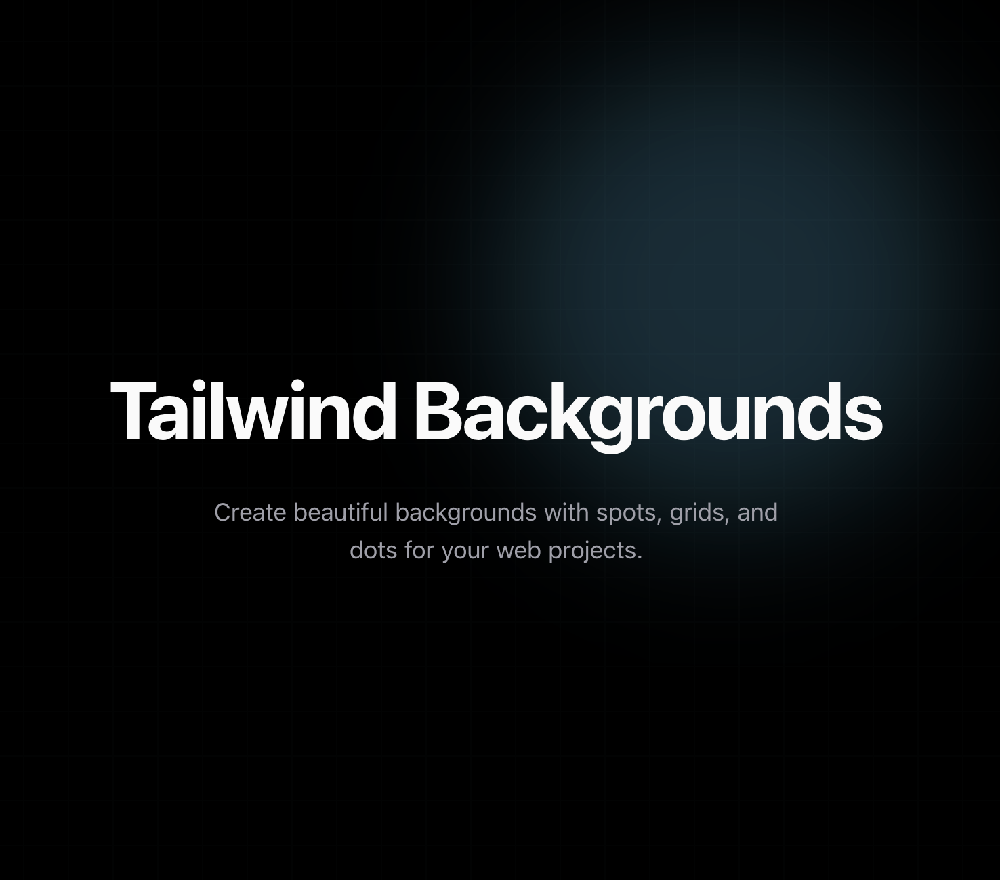

# Tailwind Backgrounds

Create beautiful backgrounds with spots, grids, and dots for your web projects. A lightweight and customizable utility for modern UIs using Tailwind CSS.

## Run Locally

Clone the project

```bash
  git clone https://link-to-project
```

Go to the project directory

```bash
  cd my-project
```

Install dependencies and start the development server

```bash
  pnpm install
  pnpm dev
```
